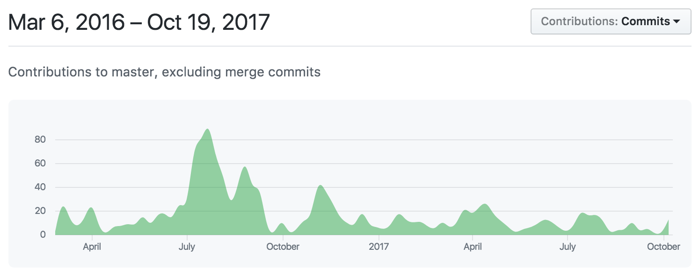

# React Navigation POC

## Requirements
 - ✅ **navigator push**
 - ✅ **navigator pop**
 - 😏 **navigator replace** _(may not implement https://github.com/wix/react-native-navigation/issues/286. Can get around this by popping and pushing without animation)_
 - ✅ **navigator pop to top**
 - 😏 **navigator pop number of routes** _(may not be implemented https://github.com/wix/react-native-navigation/issues/1591. Can get around this by popping twice.)_
 - ✅ **configurable navigation transitions per screen**
 - ✅ **select a different tab**
 - ✅ **custom styles for different platform headers**
 - ✅ **custom header components**
 - ✅ **update route params**
 - 👎🏼 **conduct navigation actions through non-screen level components**

## Bonus points
 - ✅ **hide tabbar for individual screen**
 - ✅ **standard and extendable deep link handling** _(not as baked in as react-navigation)_
 - 😏 **integrate with redux** _(works with redux, but does not look like there's a way to get navigation state from a reducer)_
 - 👎🏼 **translucent navigation bar** _(buttons and titles disappear when you try to make it blur... so... not out of the box. See https://github.com/wix/react-native-navigation/issues/442)_

## Results

### Pros
 - There is a single `navigator` object and a `showModal` function.
 - Feels smoother

### Cons
 - Doesn't support empty tabs, so no modal cart
 - Doesn't support navigation from non-screen components
 - Doesn't support out-of-the-box `navigator.replace()` _(Show-stopper?)_
 - Custom navigation bar support does not visually transition well from one screen to another.

## Activity
